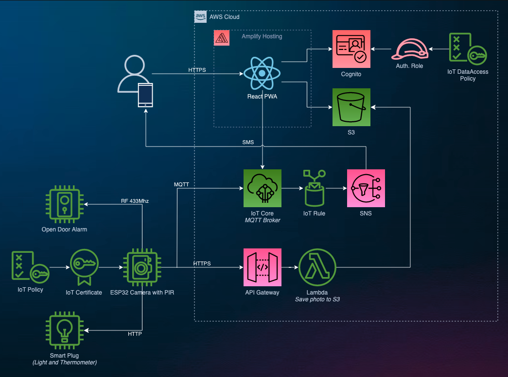

# ESP32 CAM

Intrusion detection app

## Feature

* Activate/deactivate open door alarm remotely
* Turn on light and take a picture on motion detection
* SMS notification

## Architecure diagram

## TODO

* UX/UI
* Retrieve IoT PubSub Endpoint with CustomResource ? [See](https://stackoverflow.com/questions/60347716/how-to-get-the-aws-iot-custom-endpoint-in-cdk)